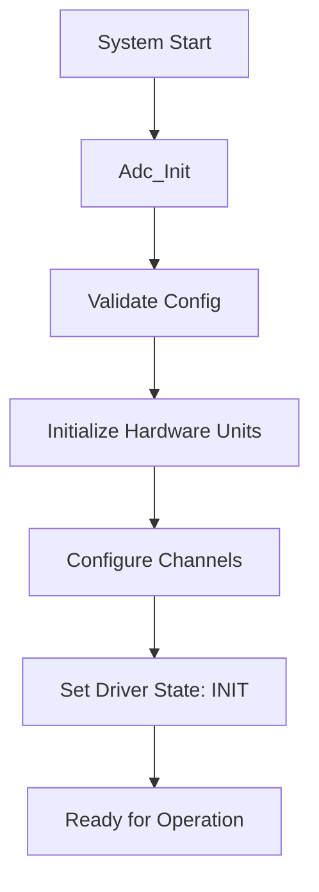
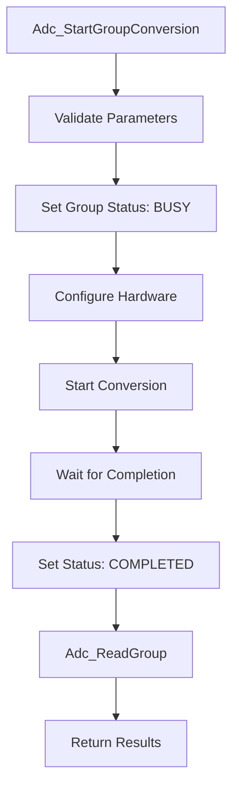
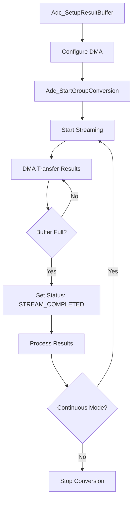

# STM32F103 ADC Driver - AUTOSAR Compliant

This directory contains a comprehensive AUTOSAR-compliant ADC (Analog-to-Digital Converter) driver implementation for STM32F103 microcontrollers. The driver supports advanced features like multi-channel conversion, DMA streaming, and both polling and interrupt-based operations.

## 📁 Directory Structure

```
2. ADC/
├── README.md                           # This file - comprehensive ADC documentation
├── Automotive/                         # AUTOSAR ADC driver implementation
│   ├── BSW/                           # Basic Software layer
│   │   └── MCAL/                      # Microcontroller Abstraction Layer
│   │       └── ADC/                   # ADC driver files
│   │           ├── Inc/               # Header files
│   │           │   ├── Adc.h          # Main ADC driver interface
│   │           │   ├── Adc_Cfg.h      # ADC configuration definitions
│   │           │   ├── Adc_Types.h    # ADC type definitions
│   │           │   └── Adc_Hw.h       # Hardware abstraction layer
│   │           └── Src/               # Source files
│   │               ├── Adc.c          # Main ADC driver implementation
│   │               └── Adc_Hw.c       # Hardware-specific implementation
│   ├── Config/                        # Configuration files
│   └── Common/                        # Common utilities
├── Core/                              # STM32 Core system files
├── SPL/                               # Standard Peripheral Library files
├── Test/                              # Test files and validation
├── build/                             # Compiled output files
├── main.c                             # Example application
├── isr.c                              # Interrupt service routines
├── makefile                           # Build configuration
├── startup_stm32f103.s                # Startup assembly file
└── stm32f103.ld                       # Linker script
```

## 🔬 ADC Fundamentals

### What is ADC?
An **Analog-to-Digital Converter (ADC)** converts continuous analog voltage signals into discrete digital values that microcontrollers can process and manipulate.

### Key ADC Concepts

#### **1. Resolution & Digital Values**
```c
// 12-bit ADC: 2^12 = 4096 discrete levels (0-4095)
Digital_Value = (Analog_Voltage / Reference_Voltage) × 4095

// Example calculations:
// Vref = 3.3V, Vin = 1.65V
// Digital_Value = (1.65V / 3.3V) × 4095 = 2047 (50% of full scale)

// Voltage calculation from digital value:
// Analog_Voltage = (Digital_Value / 4095) × Reference_Voltage
```

#### **2. Sampling Rate & Timing**
```c
// Sampling Frequency calculation:
// Fs = ADC_Clock / (Sample_Time + Conversion_Time)

// STM32F103 ADC specifications:
// - ADC Clock: up to 14MHz (72MHz/6 with prescaler)
// - Conversion Time: 12.5 cycles (for 12-bit resolution)
// - Sample Time: configurable (1.5 to 239.5 cycles)

// Maximum sample rate ≈ 1 MSPS (Mega Samples Per Second)
```

#### **3. Conversion Modes**
```c
// Single Conversion Mode:
// [Start] → [Convert] → [Stop] → [Wait for next trigger]

// Continuous Mode:
// [Start] → [Convert] → [Convert] → [Convert]... → [Stop]

// Scan Mode (Multi-channel):
// [CH0] → [CH1] → [CH2] → [CH3] → [CH0]... (sequence repeat)
```

## 🔌 Hardware Setup

### **STM32F103 ADC Pin Configuration**

```c
// ADC1 Channel Mapping:
// PA0 - ADC1_IN0    (Channel 0)
// PA1 - ADC1_IN1    (Channel 1) 
// PA2 - ADC1_IN2    (Channel 2)
// PA3 - ADC1_IN3    (Channel 3)
// PA4 - ADC1_IN4    (Channel 4)
// PA5 - ADC1_IN5    (Channel 5)
// PA6 - ADC1_IN6    (Channel 6)
// PA7 - ADC1_IN7    (Channel 7)
// PB0 - ADC1_IN8    (Channel 8)
// PB1 - ADC1_IN9    (Channel 9)
// PC0 - ADC1_IN10   (Channel 10)
// PC1 - ADC1_IN11   (Channel 11)
// PC2 - ADC1_IN12   (Channel 12)
// PC3 - ADC1_IN13   (Channel 13)
// PC4 - ADC1_IN14   (Channel 14)
// PC5 - ADC1_IN15   (Channel 15)
```

### **Typical Hardware Connections**

#### **Single Channel Setup (Potentiometer Reading)**
```
Potentiometer:
VCC (3.3V) ----[POT]---- GND
                 |
                PA0 (ADC1_IN0)

Code Configuration:
- Channel: ADC1_IN0
- Sample Time: 55.5 cycles
- Resolution: 12-bit
- Mode: Single conversion
```

#### **Multi-Channel Setup (Sensor Array)**
```
Temperature Sensor ---> PA0 (ADC1_IN0)
Light Sensor --------> PA1 (ADC1_IN1)  
Pressure Sensor -----> PA2 (ADC1_IN2)
Voltage Monitor -----> PA3 (ADC1_IN3)

Code Configuration:
- Channels: 0, 1, 2, 3
- Mode: Scan + Continuous
- DMA: Enabled
- Buffer: Circular
```

## 🏗️ Driver Architecture

### **AUTOSAR Layer Structure**
```
┌─────────────────────────────────────────────────┐
│                Application Layer                 │ ← User application code
├─────────────────────────────────────────────────┤
│              RTE (Runtime Environment)          │ ← AUTOSAR communication
├─────────────────────────────────────────────────┤
│                Service Layer                    │ ← System services
├─────────────────────────────────────────────────┤
│                   ECU AL                        │ ← ECU abstraction
├─────────────────────────────────────────────────┤
│  MCAL (Microcontroller Abstraction Layer)      │ ← This ADC driver
│  ┌─────────────────────────────────────────────┐ │
│  │           ADC Driver (Adc.c)               │ │ ← Main interface
│  │  ┌─────────────────────────────────────────┐│ │
│  │  │     Hardware Layer (Adc_Hw.c)         ││ │ ← Hardware specific
│  │  └─────────────────────────────────────────┘│ │
│  └─────────────────────────────────────────────┘ │
├─────────────────────────────────────────────────┤
│               Hardware (STM32F103)              │ ← Physical hardware
└─────────────────────────────────────────────────┘
```

### **Driver Components**

#### **1. Main Driver Interface (`Adc.c`)**
- AUTOSAR API implementation
- Parameter validation
- State management
- Error handling

#### **2. Hardware Abstraction (`Adc_Hw.c`)**
- STM32F103-specific implementation
- Register manipulation
- Interrupt handling
- DMA configuration

#### **3. Configuration (`Adc_Cfg.h`)**
- Compile-time configuration
- Channel definitions
- Hardware unit settings

#### **4. Type Definitions (`Adc_Types.h`)**
- AUTOSAR-compliant data types
- Enumerations and structures
- Error codes

## 📚 API Reference

### **Initialization Functions**

#### **Adc_Init()**
```c
void Adc_Init(const Adc_ConfigType* ConfigPtr);

// Description: Initializes the ADC driver
// Parameters:
//   ConfigPtr: Pointer to ADC configuration structure
// Returns: void
// Usage Example:
Adc_Init(&Adc_Config);
```

#### **Adc_DeInit()**
```c
void Adc_DeInit(void);

// Description: Deinitializes the ADC driver and resets hardware
// Parameters: None
// Returns: void
```

### **Group Management Functions**

#### **Adc_StartGroupConversion()**
```c
void Adc_StartGroupConversion(Adc_GroupType Group);

// Description: Starts conversion for specified group
// Parameters:
//   Group: ADC group identifier
// Usage Example:
Adc_StartGroupConversion(ADC_GROUP_SENSORS);
```

#### **Adc_StopGroupConversion()**
```c
void Adc_StopGroupConversion(Adc_GroupType Group);

// Description: Stops ongoing conversion for specified group
```

#### **Adc_GetGroupStatus()**
```c
Adc_StatusType Adc_GetGroupStatus(Adc_GroupType Group);

// Description: Returns current status of specified group
// Return values:
//   ADC_IDLE: No conversion ongoing
//   ADC_BUSY: Conversion in progress
//   ADC_COMPLETED: Conversion completed
//   ADC_STREAM_COMPLETED: Stream conversion completed
```

### **Result Reading Functions**

#### **Adc_ReadGroup()**
```c
Std_ReturnType Adc_ReadGroup(Adc_GroupType Group, Adc_ValueGroupType* DataBufferPtr);

// Description: Reads conversion results for a group
// Parameters:
//   Group: ADC group identifier
//   DataBufferPtr: Pointer to result buffer
// Returns:
//   E_OK: Results successfully read
//   E_NOT_OK: No results available or error
```

### **Streaming Functions**

#### **Adc_SetupResultBuffer()**
```c
Std_ReturnType Adc_SetupResultBuffer(Adc_GroupType Group, Adc_ValueGroupType* DataBufferPtr);

// Description: Sets up result buffer for streaming mode
// Parameters:
//   Group: ADC group identifier  
//   DataBufferPtr: Pointer to result buffer array
```

#### **Adc_GetStreamLastPointer()**
```c
Std_ReturnType Adc_GetStreamLastPointer(Adc_GroupType Group, Adc_ValueGroupType** PtrToSamplePtr);

// Description: Gets pointer to last converted sample in stream
```

### **Utility Functions**

#### **Adc_GetVersionInfo()**
```c
void Adc_GetVersionInfo(Std_VersionInfoType* VersionInfo);

// Description: Returns version information of ADC driver
```

## 🔄 Function Flow

### **Initialization Sequence**


### **Single Conversion Flow**


### **Streaming Mode Flow**


## ⚙️ Configuration Guide

### **Basic Configuration Example**

#### **1. Single Channel Configuration**
```c
// Adc_Cfg.h
#define ADC_MAX_GROUPS          1
#define ADC_MAX_CHANNELS        1
#define ADC_MAX_HW_UNITS        1

// Group configuration
const Adc_GroupDefType Adc_GroupConfig[ADC_MAX_GROUPS] = {
    {
        .Adc_GroupId = ADC_GROUP_POTENTIOMETER,
        .Adc_GroupConversionMode = ADC_CONV_MODE_ONESHOT,
        .Adc_GroupTriggSrc = ADC_TRIGG_SRC_SW,
        .Adc_HwUnit = ADC_HWUNIT_0,
        .Adc_StreamNumSamples = 1,
        .Adc_StreamResultGroupSize = 1,
        .Adc_GroupChannelRefs = {ADC_CHANNEL_0},
        .Adc_GroupChannelCount = 1
    }
};
```

#### **2. Multi-Channel Configuration**
```c
// Multi-sensor group configuration
const Adc_GroupDefType Adc_GroupConfig[ADC_MAX_GROUPS] = {
    {
        .Adc_GroupId = ADC_GROUP_SENSORS,
        .Adc_GroupConversionMode = ADC_CONV_MODE_CONTINUOUS,
        .Adc_GroupTriggSrc = ADC_TRIGG_SRC_SW,
        .Adc_HwUnit = ADC_HWUNIT_0,
        .Adc_StreamNumSamples = 10,
        .Adc_StreamResultGroupSize = 4,
        .Adc_GroupChannelRefs = {ADC_CHANNEL_0, ADC_CHANNEL_1, ADC_CHANNEL_2, ADC_CHANNEL_3},
        .Adc_GroupChannelCount = 4
    }
};
```

### **Hardware Unit Configuration**
```c
const Adc_HwUnitConfigType Adc_HwUnitConfig[ADC_MAX_HW_UNITS] = {
    {
        .Adc_HwUnitId = ADC_HWUNIT_0,
        .Adc_ClockSource = ADC_CLOCKSOURCE_PCLK2_DIV6,
        .Adc_PrescaleFactor = ADC_PRESCALE_DIV6,
        .Adc_AdcResolution = ADC_RESOLUTION_12BIT,
        .Adc_ScanConversionEnable = STD_ON,
        .Adc_ContinuousConvMode = STD_OFF
    }
};
```

## 💡 Usage Examples

### **Example 1: Single Channel Potentiometer Reading**
```c
#include "Adc.h"

// Configuration
#define POT_CHANNEL     ADC_GROUP_POTENTIOMETER
#define BUFFER_SIZE     1

// Global variables
Adc_ValueGroupType AdcResults[BUFFER_SIZE];
uint16 PotentiometerValue = 0;

int main(void)
{
    // Initialize ADC driver
    Adc_Init(&Adc_Config);
    
    while(1)
    {
        // Start single conversion
        Adc_StartGroupConversion(POT_CHANNEL);
        
        // Wait for conversion to complete
        while(Adc_GetGroupStatus(POT_CHANNEL) == ADC_BUSY)
        {
            // Wait or do other tasks
        }
        
        // Read result
        if(Adc_ReadGroup(POT_CHANNEL, AdcResults) == E_OK)
        {
            PotentiometerValue = AdcResults[0];
            
            // Convert to voltage (3.3V reference)
            float voltage = (PotentiometerValue * 3.3f) / 4095.0f;
            
            // Process the value
            ProcessPotentiometerValue(voltage);
        }
        
        // Delay before next reading
        HAL_Delay(100);
    }
}
```

### **Example 2: Multi-Channel Sensor Monitoring**
```c
#include "Adc.h"

// Configuration
#define SENSOR_GROUP    ADC_GROUP_SENSORS
#define NUM_CHANNELS    4
#define NUM_SAMPLES     10
#define BUFFER_SIZE     (NUM_CHANNELS * NUM_SAMPLES)

// Global variables
Adc_ValueGroupType SensorBuffer[BUFFER_SIZE];
float SensorValues[NUM_CHANNELS];

// Sensor channel mapping
typedef enum {
    TEMP_SENSOR = 0,
    LIGHT_SENSOR = 1,
    PRESSURE_SENSOR = 2,
    VOLTAGE_MONITOR = 3
} SensorChannel_t;

int main(void)
{
    // Initialize ADC driver
    Adc_Init(&Adc_Config);
    
    // Setup streaming buffer
    Adc_SetupResultBuffer(SENSOR_GROUP, SensorBuffer);
    
    // Start continuous conversion
    Adc_StartGroupConversion(SENSOR_GROUP);
    
    while(1)
    {
        // Check if streaming completed
        if(Adc_GetGroupStatus(SENSOR_GROUP) == ADC_STREAM_COMPLETED)
        {
            // Process each channel
            for(uint8 channel = 0; channel < NUM_CHANNELS; channel++)
            {
                uint32 sum = 0;
                
                // Calculate average for each channel
                for(uint8 sample = 0; sample < NUM_SAMPLES; sample++)
                {
                    uint16 index = (sample * NUM_CHANNELS) + channel;
                    sum += SensorBuffer[index];
                }
                
                uint16 average = sum / NUM_SAMPLES;
                SensorValues[channel] = (average * 3.3f) / 4095.0f;
            }
            
            // Process sensor data
            ProcessSensorData(SensorValues);
            
            // Restart conversion for next batch
            Adc_StartGroupConversion(SENSOR_GROUP);
        }
        
        // Do other tasks
        DoOtherTasks();
    }
}

void ProcessSensorData(float* sensors)
{
    float temperature = ConvertToTemperature(sensors[TEMP_SENSOR]);
    float lightLevel = ConvertToLux(sensors[LIGHT_SENSOR]);
    float pressure = ConvertToPascal(sensors[PRESSURE_SENSOR]);
    float batteryVoltage = sensors[VOLTAGE_MONITOR];
    
    // Log or transmit data
    printf("Temp: %.1f°C, Light: %.0f lux, Pressure: %.0f Pa, Battery: %.2fV\n",
           temperature, lightLevel, pressure, batteryVoltage);
}
```

### **Example 3: DMA Streaming with Circular Buffer**
```c
#include "Adc.h"

// Configuration for high-speed data acquisition
#define SIGNAL_GROUP    ADC_GROUP_SIGNAL
#define BUFFER_SIZE     1000
#define SAMPLE_RATE     10000  // 10 kSPS

// Double buffering for continuous operation
Adc_ValueGroupType SignalBuffer_A[BUFFER_SIZE];
Adc_ValueGroupType SignalBuffer_B[BUFFER_SIZE];
volatile boolean UseBufferA = TRUE;
volatile boolean BufferReady = FALSE;

// DMA complete callback
void Adc_GroupEndConversion_Signal(void)
{
    // Switch buffers
    UseBufferA = !UseBufferA;
    
    // Setup next buffer
    if(UseBufferA)
    {
        Adc_SetupResultBuffer(SIGNAL_GROUP, SignalBuffer_A);
    }
    else
    {
        Adc_SetupResultBuffer(SIGNAL_GROUP, SignalBuffer_B);
    }
    
    // Signal that data is ready for processing
    BufferReady = TRUE;
}

int main(void)
{
    // Initialize ADC driver
    Adc_Init(&Adc_Config);
    
    // Setup initial buffer
    Adc_SetupResultBuffer(SIGNAL_GROUP, SignalBuffer_A);
    
    // Start continuous streaming
    Adc_StartGroupConversion(SIGNAL_GROUP);
    
    while(1)
    {
        if(BufferReady)
        {
            // Process the completed buffer
            if(UseBufferA)
            {
                ProcessSignalBuffer(SignalBuffer_B, BUFFER_SIZE);
            }
            else
            {
                ProcessSignalBuffer(SignalBuffer_A, BUFFER_SIZE);
            }
            
            BufferReady = FALSE;
        }
        
        // Other real-time tasks
        DoRealTimeTasks();
    }
}

void ProcessSignalBuffer(Adc_ValueGroupType* buffer, uint16 size)
{
    // Perform signal processing
    float average = 0;
    uint16 max_val = 0;
    uint16 min_val = 4095;
    
    for(uint16 i = 0; i < size; i++)
    {
        average += buffer[i];
        if(buffer[i] > max_val) max_val = buffer[i];
        if(buffer[i] < min_val) min_val = buffer[i];
    }
    
    average /= size;
    
    // Convert to meaningful units
    float avg_voltage = (average * 3.3f) / 4095.0f;
    float peak_to_peak = ((max_val - min_val) * 3.3f) / 4095.0f;
    
    // Log or process the data
    TransmitSignalData(avg_voltage, peak_to_peak);
}
```

## 🔄 Implementation Patterns

### **Pattern 1: Polling-Based Reading**
```c
// Simple polling pattern for low-frequency measurements
Std_ReturnType ReadSensorPolling(Adc_GroupType group, float* result)
{
    Adc_ValueGroupType buffer[1];
    
    // Start conversion
    Adc_StartGroupConversion(group);
    
    // Wait with timeout
    uint32 timeout = 1000;
    while((Adc_GetGroupStatus(group) == ADC_BUSY) && (timeout > 0))
    {
        timeout--;
        HAL_Delay(1);
    }
    
    if(timeout == 0)
    {
        return E_NOT_OK;  // Timeout error
    }
    
    // Read result
    if(Adc_ReadGroup(group, buffer) == E_OK)
    {
        *result = (buffer[0] * 3.3f) / 4095.0f;
        return E_OK;
    }
    
    return E_NOT_OK;
}
```

### **Pattern 2: Interrupt-Driven Processing**
```c
// Interrupt-driven pattern for responsive applications
volatile boolean AdcConversionComplete = FALSE;
Adc_ValueGroupType InterruptBuffer[4];

// ADC completion callback
void Adc_GroupEndConversion_Sensors(void)
{
    AdcConversionComplete = TRUE;
}

void MainProcessingLoop(void)
{
    static uint32 lastConversionTime = 0;
    
    // Trigger conversion every 100ms
    if((HAL_GetTick() - lastConversionTime) >= 100)
    {
        Adc_StartGroupConversion(ADC_GROUP_SENSORS);
        lastConversionTime = HAL_GetTick();
    }
    
    // Process results when ready
    if(AdcConversionComplete)
    {
        if(Adc_ReadGroup(ADC_GROUP_SENSORS, InterruptBuffer) == E_OK)
        {
            ProcessSensorReadings(InterruptBuffer);
        }
        AdcConversionComplete = FALSE;
    }
    
    // Do other tasks
    DoOtherWork();
}
```

### **Pattern 3: State Machine for Complex Sequences**
```c
// State machine pattern for complex measurement sequences
typedef enum {
    ADC_STATE_IDLE,
    ADC_STATE_CALIBRATING,
    ADC_STATE_MEASURING,
    ADC_STATE_PROCESSING,
    ADC_STATE_ERROR
} AdcStateMachine_t;

static AdcStateMachine_t AdcState = ADC_STATE_IDLE;
static uint8 CalibrationStep = 0;
static uint8 MeasurementCount = 0;

void AdcStateMachineProcess(void)
{
    switch(AdcState)
    {
        case ADC_STATE_IDLE:
            if(StartMeasurementRequest())
            {
                AdcState = ADC_STATE_CALIBRATING;
                CalibrationStep = 0;
            }
            break;
            
        case ADC_STATE_CALIBRATING:
            if(PerformCalibrationStep(CalibrationStep))
            {
                CalibrationStep++;
                if(CalibrationStep >= MAX_CALIBRATION_STEPS)
                {
                    AdcState = ADC_STATE_MEASURING;
                    MeasurementCount = 0;
                }
            }
            break;
            
        case ADC_STATE_MEASURING:
            if(PerformMeasurement(MeasurementCount))
            {
                MeasurementCount++;
                if(MeasurementCount >= REQUIRED_MEASUREMENTS)
                {
                    AdcState = ADC_STATE_PROCESSING;
                }
            }
            break;
            
        case ADC_STATE_PROCESSING:
            if(ProcessAllMeasurements())
            {
                AdcState = ADC_STATE_IDLE;
            }
            break;
            
        case ADC_STATE_ERROR:
            HandleErrorCondition();
            AdcState = ADC_STATE_IDLE;
            break;
    }
}
```

## 🔧 Troubleshooting

### **Common Issues and Solutions**

#### **1. No Conversion Results**
```c
// Problem: Adc_ReadGroup always returns E_NOT_OK
// Possible causes:
// - ADC not initialized
// - Wrong group ID
// - Conversion not started
// - Hardware error

// Debugging steps:
void DebugNoResults(void)
{
    // Check driver state
    if(Adc_GetDriverState() != ADC_INIT)
    {
        // Driver not initialized
        DebugPrint("ADC Driver not initialized!");
        return;
    }
    
    // Check group status
    Adc_StatusType status = Adc_GetGroupStatus(ADC_GROUP_TEST);
    DebugPrint("Group status: %d", status);
    
    // Verify hardware configuration
    if(!ADC_HW_IS_CHANNEL_CONFIGURED(ADC_CHANNEL_0))
    {
        DebugPrint("Channel not configured!");
    }
}
```

#### **2. Incorrect Voltage Readings**
```c
// Problem: ADC readings don't match expected voltage
// Possible causes:
// - Wrong reference voltage
// - Incorrect resolution
// - Hardware wiring issues
// - Software calibration needed

// Verification function:
void VerifyAdcReading(void)
{
    Adc_ValueGroupType testValue = 2048;  // Should be ~1.65V at 3.3V ref
    
    float calculatedVoltage = (testValue * 3.3f) / 4095.0f;
    DebugPrint("Test calculation: %d -> %.3f V", testValue, calculatedVoltage);
    
    // Test with known voltage source
    Adc_ValueGroupType buffer[1];
    if(Adc_ReadGroup(ADC_GROUP_TEST, buffer) == E_OK)
    {
        float measured = (buffer[0] * 3.3f) / 4095.0f;
        DebugPrint("Measured: %d -> %.3f V", buffer[0], measured);
    }
}
```

#### **3. DMA Transfer Issues**
```c
// Problem: Streaming mode not working properly
// Possible causes:
// - DMA not configured
// - Buffer alignment issues
// - Interrupt priority conflicts
// - Memory corruption

// DMA debugging:
void DebugDmaIssues(void)
{
    // Check DMA status
    if(!DMA_GetFlagStatus(DMA1_FLAG_TC1))
    {
        DebugPrint("DMA transfer not complete");
    }
    
    // Verify buffer integrity
    for(uint16 i = 0; i < BUFFER_SIZE; i++)
    {
        if(DmaBuffer[i] == 0xDEAD)  // Marker value for unwritten data
        {
            DebugPrint("Buffer not filled at index %d", i);
            break;
        }
    }
    
    // Check interrupt priorities
    DebugPrint("DMA IRQ Priority: %d", NVIC_GetPriority(DMA1_Channel1_IRQn));
    DebugPrint("ADC IRQ Priority: %d", NVIC_GetPriority(ADC1_2_IRQn));
}
```

#### **4. Timing and Performance Issues**
```c
// Problem: Conversions too slow or too fast
// Solutions: Adjust timing parameters

void OptimizeAdcTiming(void)
{
    // For faster conversions (lower accuracy):
    // - Reduce sample time
    // - Increase ADC clock
    // - Use single channel mode
    
    // For higher accuracy (slower):
    // - Increase sample time
    // - Enable averaging
    // - Reduce ADC clock
    
    // Example configuration for different requirements:
    
    // High speed, moderate accuracy:
    // Sample time: 1.5 cycles
    // ADC clock: 14MHz
    // Expected rate: ~800 kSPS
    
    // High accuracy, moderate speed:
    // Sample time: 239.5 cycles  
    // ADC clock: 9MHz
    // Expected rate: ~35 kSPS
}
```

## ⚡ Performance Considerations

### **Timing Analysis**
```c
// ADC conversion timing calculations
// Total conversion time = Sample Time + Conversion Time

// Example configurations:
// Config 1: High Speed
#define SAMPLE_TIME_FAST    ADC_SampleTime_1Cycles5
#define EXPECTED_RATE_FAST  800000  // 800 kSPS

// Config 2: Balanced
#define SAMPLE_TIME_NORMAL  ADC_SampleTime_55Cycles5  
#define EXPECTED_RATE_NORMAL 100000  // 100 kSPS

// Config 3: High Accuracy
#define SAMPLE_TIME_SLOW    ADC_SampleTime_239Cycles5
#define EXPECTED_RATE_SLOW  35000   // 35 kSPS
```

### **Memory Usage Optimization**
```c
// Buffer size calculations for different scenarios

// Single channel, 1 sample:
#define SINGLE_BUFFER_SIZE  1
// Memory: 2 bytes

// Multi-channel (4 channels), 10 samples each:
#define MULTI_BUFFER_SIZE   (4 * 10)
// Memory: 80 bytes

// High-speed streaming, 1000 samples:
#define STREAM_BUFFER_SIZE  1000
// Memory: 2000 bytes

// Double buffering for continuous operation:
#define DOUBLE_BUFFER_SIZE  (2 * 1000)
// Memory: 4000 bytes
```

## ✅ Best Practices

### **1. Initialization Best Practices**
```c
// Always validate configuration before using
Std_ReturnType SafeAdcInit(const Adc_ConfigType* config)
{
    // Validate configuration
    if(config == NULL_PTR)
    {
        return E_NOT_OK;
    }
    
    // Check hardware availability
    if(!IsAdcHardwareAvailable())
    {
        return E_NOT_OK;
    }
    
    // Initialize with error handling
    Adc_Init(config);
    
    // Verify initialization
    if(Adc_GetDriverState() != ADC_INIT)
    {
        return E_NOT_OK;
    }
    
    return E_OK;
}
```

### **2. Error Handling Best Practices**
```c
// Robust error handling pattern
Std_ReturnType RobustAdcReading(Adc_GroupType group, float* result)
{
    Adc_ValueGroupType buffer[1];
    uint8 retryCount = 0;
    const uint8 MAX_RETRIES = 3;
    
    while(retryCount < MAX_RETRIES)
    {
        // Start conversion
        Adc_StartGroupConversion(group);
        
        // Wait with timeout
        uint32 timeout = 1000;
        while((Adc_GetGroupStatus(group) == ADC_BUSY) && (timeout > 0))
        {
            timeout--;
            HAL_Delay(1);
        }
        
        if(timeout == 0)
        {
            retryCount++;
            continue;  // Timeout, retry
        }
        
        // Try to read result
        if(Adc_ReadGroup(group, buffer) == E_OK)
        {
            *result = (buffer[0] * 3.3f) / 4095.0f;
            return E_OK;  // Success
        }
        
        retryCount++;
    }
    
    return E_NOT_OK;  // All retries failed
}
```

### **3. Resource Management Best Practices**
```c
// Proper resource cleanup
void CleanupAdcResources(void)
{
    // Stop all ongoing conversions
    for(Adc_GroupType group = 0; group < ADC_MAX_GROUPS; group++)
    {
        if(Adc_GetGroupStatus(group) == ADC_BUSY)
        {
            Adc_StopGroupConversion(group);
        }
    }
    
    // Disable notifications
    for(Adc_GroupType group = 0; group < ADC_MAX_GROUPS; group++)
    {
        Adc_DisableGroupNotification(group);
    }
    
    // Deinitialize driver
    Adc_DeInit();
}
```

### **4. Performance Optimization Best Practices**
```c
// Optimize for specific use cases
void OptimizeForUseCase(AdcUseCase_t useCase)
{
    switch(useCase)
    {
        case ADC_USE_CASE_BATTERY_MONITORING:
            // Low frequency, high accuracy
            ConfigureForAccuracy();
            break;
            
        case ADC_USE_CASE_AUDIO_SAMPLING:
            // High frequency, moderate accuracy
            ConfigureForSpeed();
            break;
            
        case ADC_USE_CASE_SENSOR_ARRAY:
            // Multiple channels, balanced performance
            ConfigureForMultiChannel();
            break;
            
        case ADC_USE_CASE_SIGNAL_ANALYSIS:
            // High speed streaming
            ConfigureForStreaming();
            break;
    }
}
```

## 📞 Support and Documentation

### **Additional Resources**
- **AUTOSAR Specification**: ADC Driver specification document
- **STM32F103 Reference Manual**: Hardware register descriptions
- **Application Notes**: ST Microelectronics ADC application notes
- **Code Examples**: See `main.c` and test files for working examples

### **Contact Information**
- **Author**: hoangphuc540202@gmail.com
- **GitHub**: https://github.com/HoangPhuc02
- **Version**: 2.0.0
- **Date**: June 24, 2025

---

## 🎯 Quick Start Checklist

- [ ] **Hardware Setup**: Connect your analog signals to appropriate ADC pins
- [ ] **Configuration**: Modify `Adc_Cfg.h` for your specific needs
- [ ] **Initialization**: Call `Adc_Init(&Adc_Config)` in your main function
- [ ] **Basic Test**: Try single channel reading with `Adc_StartGroupConversion()` and `Adc_ReadGroup()`
- [ ] **Validation**: Verify readings with known voltage sources
- [ ] **Integration**: Implement in your application with proper error handling

This ADC driver provides a robust, AUTOSAR-compliant foundation for all your analog signal measurement needs on STM32F103 platforms! 🚀
